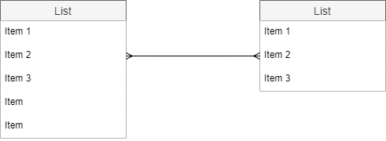

# 見出し1
## 見出し2
### 見出し3

- aaa
- bbb
- ccc

1. aaa
1. bbb
1. ccc

- [ ] aaa
- [x] bbb
- [ ] ccc

斜体は *このように* 表示されます。

*強調*
 
_これも強調_
 
**もっと強調**
 
__同じくもっと強調__

太字は **このように** 表示されます。

打ち消しは ~~このように~~ 表示されます。

> xxx

[リンク](https://www.google.com/)




a|b|c
---|---|---
1|2|3
4|5|6
7|8|9
10|11|12

```html:sample.html
<html>
<head></head>
<body>aaa</body>
</html>
```

インラインコードは `このように` 表示されます。

<details>
<summary>xxx</summary>

aaaaaaaaaaaaaaaaaaaaa
bbbbbbbbbbbbbbbbbbb
ccccccccccccccccccccc
</details>

$$ x = {-b \pm \sqrt{b^2-4ac} \over 2a} $$